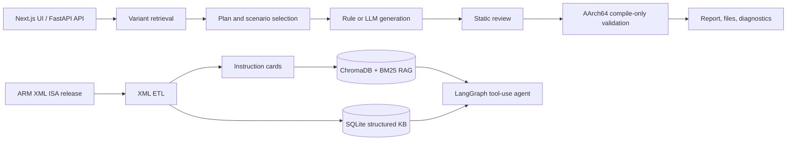

# ARM ISA Copilot Agent

ARM ISA Copilot Agent is a domain-specific AI assistant for the ARM A-profile
AArch64 ISA. It turns the official ARM XML ISA specification into structured
instruction knowledge, searchable RAG material, assembly test programs, and
compile-only verification reports.

The project currently covers A64 base instructions, Advanced SIMD, SVE, SVE2,
SME, MOPS, LS64, and related architecture extensions present in the bundled
ARM XML release.

## What It Does

- Parses ARM XML instruction variants, encodings, assembly templates, operands,
  architecture features, pseudocode, and constraints into SQLite.
- Builds an exhaustive functional taxonomy for all imported XML variants.
- Provides an Explore UI with category, subcategory, and per-variant detail
  pages, including encodings, operand metadata, constraints, and pseudocode.
- Generates single-instruction rule-based scenario suites. Applicable scenarios
  include baseline assembly, register dependency chains, operand boundaries,
  vector register variation, and scalar inline-assembly programs.
- Generates batch scenario programs. One input line is one program; comma-
  separated mnemonics on that line must be present in the same generated file.
- Enforces a per-program instruction budget and target instruction occurrence
  count, with static review before compilation.
- Supports optional LLM-assisted natural-language target extraction and assembly
  generation, followed by programmatic validation and repair of count/target
  constraints.
- Compiles generated AArch64 assembly with a local cross-capable assembler or
  Clang. Verification is compile-only; it does not claim runtime execution on
  QEMU or hardware.
- Includes a LangGraph-based tool-use agent for interactive ISA questions and
  RAG-backed analysis.

## Verification Model

Generated artifacts are reported in three layers:

1. `generated`: an assembly or inline-assembly program was produced.
2. `statically_reviewed`: the instruction budget, requested target counts,
   labels, and XML-derived constraints passed rule checks.
3. `compiled`: the AArch64 toolchain accepted the generated artifact.

`compiled` means syntax and assembler/compiler acceptance only. It is not an
emulation or architectural-behavior result.

## Architecture



## XML Taxonomy Coverage

The bundled ARM release is imported as XML instruction variants rather than a
short manually maintained mnemonic list. The current imported knowledge base
contains 2,262 variants and 4,584 encodings. Categories include:

- A64 Base Integer; Branch, Exception, and Control Flow; Load/Store; Atomic
  and Memory Ordering; System; Security; Cryptography; Floating Point.
- A64 Advanced SIMD, SVE, SVE2, SME, MOPS, and LS64.

Taxonomy assignments are stored separately from instruction records, so future
XML releases and new architectural features can be re-imported and classified
without changing the UI data model.

## Repository Layout

```text
src/arm_isa_agent/
  api/                 FastAPI routes, SSE endpoints, request schemas
  agent/               LangGraph agent, state, prompts, tool registry
  assembly/            XML-aware assembly instantiation and scenario generation
  compile/             Local AArch64 compile-only verifier
  etl/                 ARM XML parser, constraint extraction, import pipeline
  kb/                  SQLite models, taxonomy service, ChromaDB client
  rag/                 Instruction cards, embeddings, BM25 and hybrid retrieval
  verification/        Single and batch verification orchestration
frontend/              Next.js application
tests/                 Parser, taxonomy, scenario, and verification tests
ISA_A64_xml_*/         Bundled ARM XML source release
```

## Prerequisites

- Python 3.11 or newer.
- Node.js 20 or newer for the frontend.
- A local AArch64-capable toolchain for the `compiled` layer. The verifier tries
  `aarch64-linux-gnu-as` first and then `clang --target=aarch64-linux-gnu`.
- An LLM API key only when LLM-assisted generation or the chat agent is used.

## Quick Start

```bash
# Backend dependencies
python -m venv .venv
.venv\Scripts\activate            # Windows PowerShell
pip install -e ".[dev]"

# Optional: configure the LLM provider
copy .env.example .env

# Import XML into SQLite and generate instruction cards
arm-isa etl run

# Optional: build the ChromaDB and BM25 RAG index
arm-isa rag index

# Start the API
uvicorn arm_isa_agent.api.app:create_app --factory --host 127.0.0.1 --port 8000
```

In a second terminal:

```bash
cd frontend
npm install
npm run dev
```

Open `http://127.0.0.1:3000`.

### Docker

```bash
docker compose up --build
```

The backend is exposed on port 8000 and the frontend on port 3000. Persisted
knowledge-base indexes are deliberately ignored by Git; build them locally with
the ETL and RAG commands above.

## Using Verification

### Single instruction

Use the Verify page or post a request to the SSE endpoint:

```bash
curl -N -X POST http://127.0.0.1:8000/api/generate_testcase/stream \
  -H "Content-Type: application/json" \
  -d "{\"instruction\": \"ADD\", \"use_llm\": false, \"instruction_count\": 100, \"target_instruction_count\": 20}"
```

Rule-based single instruction verification creates one file per applicable test
scenario. The instruction budget and target occurrence count apply to every
file in that suite.

### Batch scenarios

The Batch page accepts text input and text/CSV-style files. Each non-empty line
is one scenario program; mnemonics on the same line are comma-separated.

```text
ADD,SUB,MOV
ADDP,LDP
CMP,B.cond,B
```

The example creates three independent assembly programs. For each program, the
configured total instruction budget is exact and each requested target is
inserted according to the configured target count. Batch mode generates one
combined assembly program per line; it does not concatenate unrelated
single-instruction test files.

### LLM-assisted generation

When LLM generation is enabled, the input can be descriptive, for example:

```text
Generate a random test for ABS with register variation and 50 ABS instances.
```

The service records an LLM generation trace in the result view. XML retrieval,
budget checks, target counting, safe labels, static review, and compilation
remain deterministic server-side checks.

## API Overview

| Endpoint | Purpose |
| --- | --- |
| `GET /api/health` | Health check. |
| `POST /api/generate_testcase` | Synchronous single-instruction verification. |
| `POST /api/generate_testcase/stream` | SSE single-instruction verification. |
| `POST /api/generate_testcases/stream` | SSE per-instruction batch verification. |
| `POST /api/scenario/stream` | SSE combined-program scenario batch verification. |
| `POST /api/scenario/parse` | Parse line-based scenario text. |
| `GET /api/explore/taxonomy` | Complete functional taxonomy and coverage audit. |
| `GET /api/explore/categories/{category}` | Category and subcategory directory. |
| `GET /api/explore/categories/{category}/{subcategory}` | Paginated XML variants in a subcategory. |
| `GET /api/explore/instructions/{xml_id}` | Full XML-variant profile. |

Interactive API documentation is available at `http://127.0.0.1:8000/docs`
while the backend is running.

## Configuration

Copy `.env.example` to `.env` and set the required provider values. Important
settings include:

| Variable | Description |
| --- | --- |
| `ARM_ISA_LLM_PRESET` | `local`, `deepseek`, or empty for manual provider settings. |
| `ARM_ISA_LLM_MODEL` | LLM model name. |
| `ARM_ISA_LLM_API_KEY` | API key for the selected provider. |
| `ARM_ISA_LLM_BASE_URL` | Optional OpenAI-compatible endpoint. |
| `ARM_ISA_RAW_XML_DIR` | ARM XML release directory. |
| `ARM_ISA_SQLITE_DB_PATH` | SQLite knowledge-base path. |
| `ARM_ISA_CHROMA_PERSIST_DIR` | ChromaDB persistence directory. |
| `ARM_C_COMPILER` | Compiler executable used by compile-only validation. |

## Development

```bash
# Backend tests
$env:PYTHONPATH = "src"
python -m pytest -q

# Frontend production build
cd frontend
npm run build
```

The test suite covers XML parsing, card generation, exhaustive taxonomy
coverage, SVE/SME separation, assembly budgets, target occurrence enforcement,
and compile-oriented scenario generation.

## Scope and Limitations

- The project validates generated source with an assembler/compiler; it does
  not execute instructions in QEMU or on ARM hardware.
- Compile availability and accepted extensions depend on the installed local
  toolchain.
- The SQLite, ChromaDB, and BM25 artifacts are generated local data and are not
  versioned. Re-run ETL/RAG indexing after cloning when they are absent.
